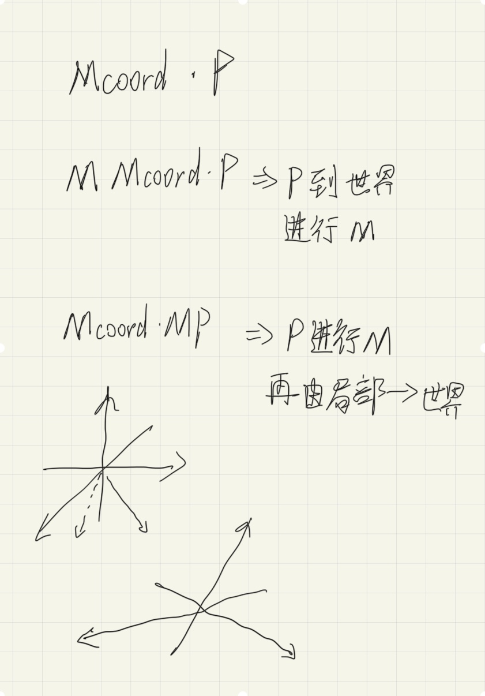
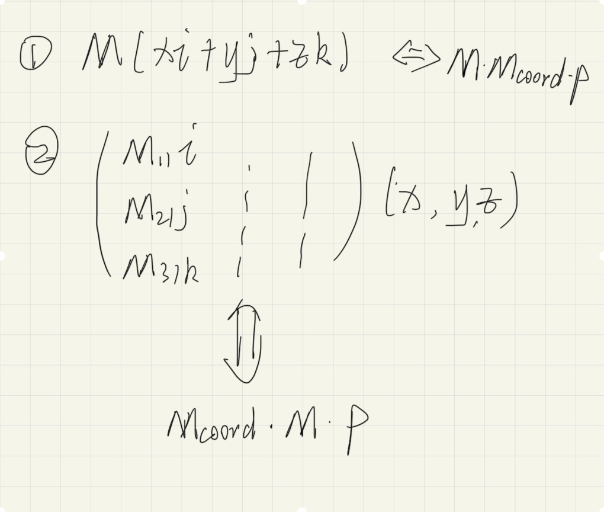
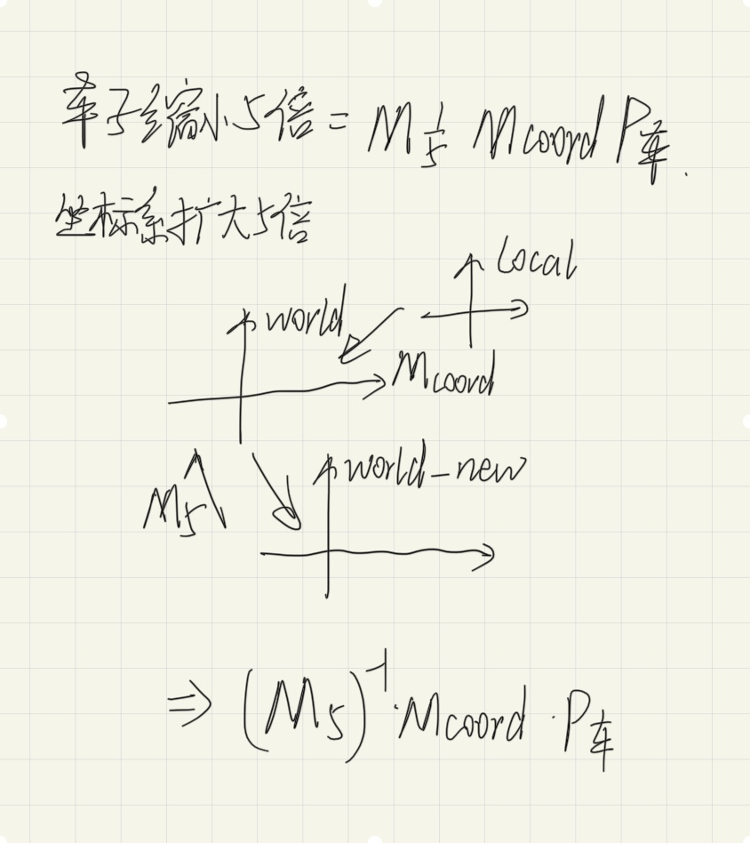

# ramble

## 3D 变换

Mcoord 相当于坐标系， 第二种 M 是在 Mcoord 的坐标系下变换。第一种是在一个隐藏的`E(即世界坐标系)`下变换的
也就形成了从左往右看是坐标系在不断变化，从右往左是坐标点在不断变化

相应的使用向量理解如下：
第二种，需要将 M 变换到 coord 对应的变换里面去

进而可以想到相似矩阵

证明：对物体变换等价于对坐标系的逆变换

eg. 车子缩小 5 倍，等价于坐标系扩大 5 倍
车子缩小 5 倍，是局部坐标系缩小 5 倍
坐标系扩大 5 倍，是世界坐标系扩大 5 倍

车子缩小 5，是在世界坐标系的尺度下缩小的（按道理，这里世界坐标系应该是和局部坐标系重合的）

对坐标系的变换，看作是产生一个新的坐标系，而不要立马舍弃原来的坐标系，由 world 转化到 world_new 恰好是逆变换

## 仓库脚本
